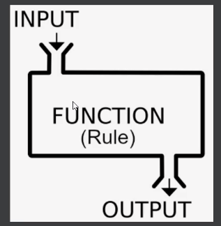

<h2 align="center">شکل کلی تابع</h2>

تابع ها به طور کلی ممکنه که ورودی داشته باشند یا نداشته باشند

<h2 align="center">use mypy to terminal</h2>

<video width="320" height="240" controls>
  <source src="PicAndVid/Func3.mp4" type="video/mp4">
  Your browser does not support the video tag.
</video>

