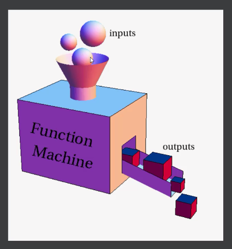

<h2 align="center">شکل کلی تابع</h2>

تابع ها به طور کلی ممکنه که ورودی داشته باشند یا نداشته باشند

<video width="320" height="240" controls>
  <source src="picture/Func1.mp4" type="video/mp4">
  Your browser does not support the video tag.
</video>